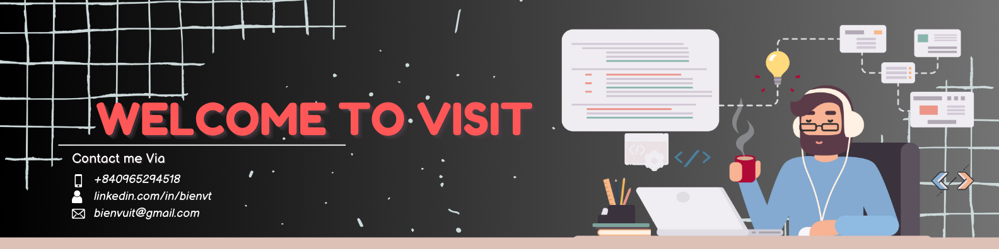

# Greetings!

Hi there 👋 — I'm Bien!

I'm a Full-Stack Developer with 12+ years of experience building scalable, high-performance web applications across diverse industries. I specialize in modern JavaScript frameworks and backend technologies including React.js, Vue.js, Node.js, PHP, MySQL, MongoDB, and GraphQL, delivering robust solutions that balance performance, usability, and maintainability.

I have deep expertise in Drupal, WordPress, Shopify, and headless CMS architectures, along with extensive hands-on experience deploying and managing applications on Linux servers, Google Cloud, Pantheon, and Acquia. I'm highly proficient with Git and CI/CD workflows, ensuring smooth development, deployment, and collaboration processes.

Beyond engineering, I’m passionate about UX/UI design and enjoy working with tools like Photoshop and Adobe XD to create user-friendly, intuitive digital experiences.

Over the past few years, I’ve stepped into leadership and mentoring roles—planning sprints, managing development workflows, supporting junior developers, and helping teams deliver efficiently within Agile/Scrum environments. I take pride in being a proactive problem-solver who thrives in collaborative teams and embraces continuous learning.

Outside of work, I love reading, running, and traveling, which fuel both my creativity and personal growth.

Based in Hanoi, I’m always open to connecting with new people—feel free to reach out!

## Focus on WHat's Important!

**Deep Work** — Staying fully engaged to deliver high-quality, meaningful results.

**Growing My Skills** — Continuously improving through learning, experimentation, and new challenges.

**Mentorship** — Supporting junior developers and sharing knowledge to help others grow.

**Strategic Planning** — Turning ideas into clear roadmaps, efficient workflows, and successful outcomes.

**Freelance Projects** — Taking on meaningful projects that solve real problems and create value.

**Collaboration** — Working with great teams and partners to build impactful, high-quality products.

If you'd love to talk or need help, visit me on [LinkedIn](https://www.linkedin.com/in/bienvt).

## Tech Stack & Tools

I work with many different technologies and languages, but my favorites are **JavaScript**, **React.js**, **Next.js**, **Node.js**, and **Headless CMS**.

   &emsp;
   &emsp;
   &emsp;
   &emsp;
   &emsp;
   &ensp;
   &ensp;
   &emsp;
   &emsp;
   &emsp;
   &emsp;
   &emsp;
   &emsp;
   &emsp;
   &emsp;
   &emsp;

## Inspirational Quotes

> “The only way to do great work is to love what you do.” – Steve Jobs

> “The harder you work, the luckier you get!”
